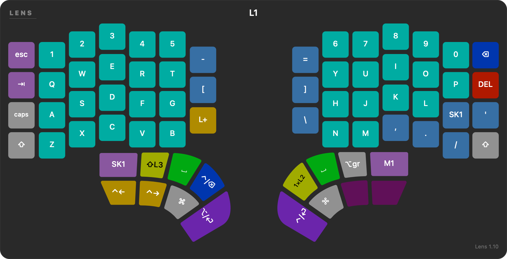

# Lens

**A live map of your Dygma Defy, floating over whatever you are working in.**

Ten layers. Sixty-odd keys each. You remapped all of it six months ago and you were
sure you would remember. Lens puts the answer on screen in the shape of the board
under your hands, and takes it away again when you press F13.



It is one Swift file, no dependencies, no Xcode project, no framework. Double-click
`Lens.app`. That is the whole thing.

---

## What it actually does

**Draws the real board, not a grid of squares.** The thumb-cap silhouettes are ported
from Bazecor's own `defy-thumb-paths.ts`, angles and all. The column stagger is the
Defy's real stagger. If your eyes can find a key on the keyboard, they can find it on
the overlay in the same place.

**Wears your own colours.** It reads the palette and the per-layer colormap out of
your Neuron backup and lights every key the way your board lights it. Layer 3 looks
like layer 3.

**Follows the live layer.** Over the serial link to the Neuron, so the overlay changes
when the board does. It hands the port back the moment Bazecor launches, and takes it
again within a second of Bazecor quitting — the port is exclusive and Bazecor should
win.

**Lights the key you press.** A listen-only event tap, so it never swallows a
keystroke. Your typing is untouched.

**Swaps legends when you hold Shift.** The number row turns into `!@#$%^&*()`, and
`' , . / [ ] \` turn into `" < > ? { } |`.

**Calls your layers by name.** Not "Layer 3" — whatever you named it in Bazecor. It
reads the names out of Bazecor's own config.

**Watches both batteries.** On a wireless Defy the corner shows `L 84%  R 79%`, read
live off the Neuron, and brightens when either half drops under 20%.

**Shrinks to a strip.** *Layer strip only* drops the board and leaves a small pill with
the layer name and the last key you pressed. Each size — strip, small, full — remembers
its own spot on screen.

**Drills you.** Turn on *Layer drill* and it picks a key, waits, and times you. Scores
persist in `drill.json` across sessions, and *Drill report* writes your slowest and
most-missed keys to `drill-report.txt`, worst first, then opens it. It is an unkind
little feature and it works.

---

## Install

Requires macOS 13 or later, Apple silicon, a Dygma Defy, and Bazecor with at least one
saved backup.

```sh
git clone https://github.com/gaberger/lens.git ~/Dygma/lens
cd ~/Dygma/lens
./refresh.sh
```

`refresh.sh` decodes your newest Bazecor backup and starts the overlay. macOS will ask
for **Input Monitoring** the first time. Say yes — that permission is what lets Lens
highlight the key you press, and Lens never sends a keystroke anywhere.

Then assign **F13** to a key in Bazecor. That is your show/hide.

---

## How it works

Three stages, each one plain enough to read in an afternoon.

**1. `decode/build_map.py` — what does code 53 mean?**
Bazecor keeps its key definitions in TypeScript tables. This script reads those tables
directly and builds `codemap.json`: 5,427 key codes mapped to legends. Reading the
source of truth beats retyping it, and it means a new Bazecor release is a `git pull`
away, not a rewrite.

**2. `decode/export_layers.py` — what is on *your* board?**
It walks `~/Dygma/Backups/Defy/`, takes the newest backup that passes a 16-bit sanity
check, and writes `layers.json`: the legends, the shifted legends, the USB usage codes,
the LED colours, and the real geometry. Transparent keys (code 65535) are resolved to
whatever the base layer does, so a pass-through key shows its true function instead of
a blank.

**3. `Lens.swift` — the window.**
An `LSUIElement` app, so no dock icon and no window list. It draws `layers.json`,
listens on a CGEvent tap for the key you pressed and the modifiers you hold, and reads
the live layer off the serial port.

After any change you save in Bazecor:

```sh
~/Dygma/lens/refresh.sh
```

---

## Options

Pass after `--args`, or leave them in `refresh.sh`. They persist in `config.json`.

| Flag | What it does |
|---|---|
| `--serial` | follow the live layer from the Neuron |
| `--toggle f13` | show/hide key; `f13`..`f24`, or `none` |
| `--at top-right` | place it; nine spots |
| `--place` | drag it where you want, ⌘Q saves and quits |
| `--pill` | layer strip only, instead of the whole board |
| `--layer 3` | pin one layer |
| `--width 900` | resize |
| `--no-colors` | plain keys instead of your LED colours |
| `--fade` | hide 1.6 s after a change |
| `--grab` | always draggable, gives up click-through |
| `--drag-mods cmd,shift` | hold these to grab it instead of `--grab` |
| `--upright-labels` | do not turn the thumb legends with the caps |
| `--replace` | take over from the copy already running (one instance only) |
| `--port <dev>` | serial device, default `/dev/cu.usbmodem1101` |
| `--map <file>` | keymap to draw, default `~/Dygma/lens/layers.json` |
| `--check` | print the Input Monitoring state and exit |

The menu-bar icon holds the rest: **Refresh keymap** (⌘R) after a change in Bazecor,
size and opacity sliders, frosted background, LED colours, the layer strip, turning the
thumb legends with the caps, always-draggable, **Layer drill** (⌘D) with its two
switches, **Drill report**, and **Reveal folder**.

---

## Two things that will bite you

**1. Rebuilding invalidates the permission.** The app is ad-hoc signed, so its identity
is derived from the binary. Change `Lens.swift`, and macOS sees a stranger:

```sh
tccutil reset ListenEvent org.sticksandstrings.dygmalens
```

Then launch it and click Allow.

**2. The Neuron's serial port is exclusive.** Lens releases it whenever Bazecor is
running and takes it back within a second of Bazecor quitting. If the layer stops
following, check whether Bazecor is open.

---

## Credit and licence

Lens is **GPL-3.0-or-later**. The full text is in [LICENSE](LICENSE).

    Lens — layer overlay for the Dygma Defy
    Copyright (C) 2026 Gary Berger

    This program is free software: you can redistribute it and/or modify it under
    the terms of the GNU General Public License as published by the Free Software
    Foundation, either version 3 of the License, or (at your option) any later
    version. It comes with ABSOLUTELY NO WARRANTY.

It has to be. The files in `decode/db/` are lifted from
[Bazecor](https://github.com/Dygmalab/Bazecor) by Keyboardio and DygmaLab SE, as is the
thumb-cap geometry in `decode/defy-thumb-paths.ts`. Those files are GPL-3.0, and a
GPL-3.0 part makes a GPL-3.0 whole.

The keymap in `layers.json` is mine. Run `refresh.sh` and it becomes yours.
